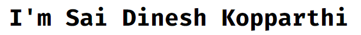

<h2 align="center">🤖 About Me</h2>

I am a recent Master's graduate in Applied Computer Science from Northwest Missouri State University with an unending enthusiasm for learning new technologies. During my Master's program, I worked as a Graduate Assistant for the iOS Mobile Computing course, which provided me the opportunity to develop several iOS applications using Swift. Additionally, I have professional experience as an Assistant System Engineer at Tata Consultancy Services in Hyderabad, India.

I love keeping myself busy with developing new types of websites every chance I get. With a particular fondness for JavaScript, I use React, Express.js, and Node.js for web development. In my free time, I enjoy lifting weights 🏋🏽 and watching Formula One 🏎️.

 
 

  

<h3 align="center">Git Stats</h3>

 
  
   

      

<h2 align="center">📫 Let's Connect!</h2>

<table align="center">
  <tr>
    <td colspan="3" align="center">
      
    </td>
    <td align="center">
      
    </td>
    <td align="center">
      
    </td>
  </tr>
</table>

